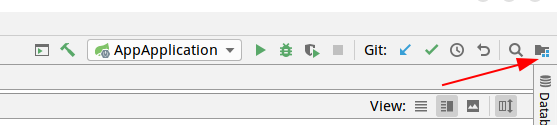
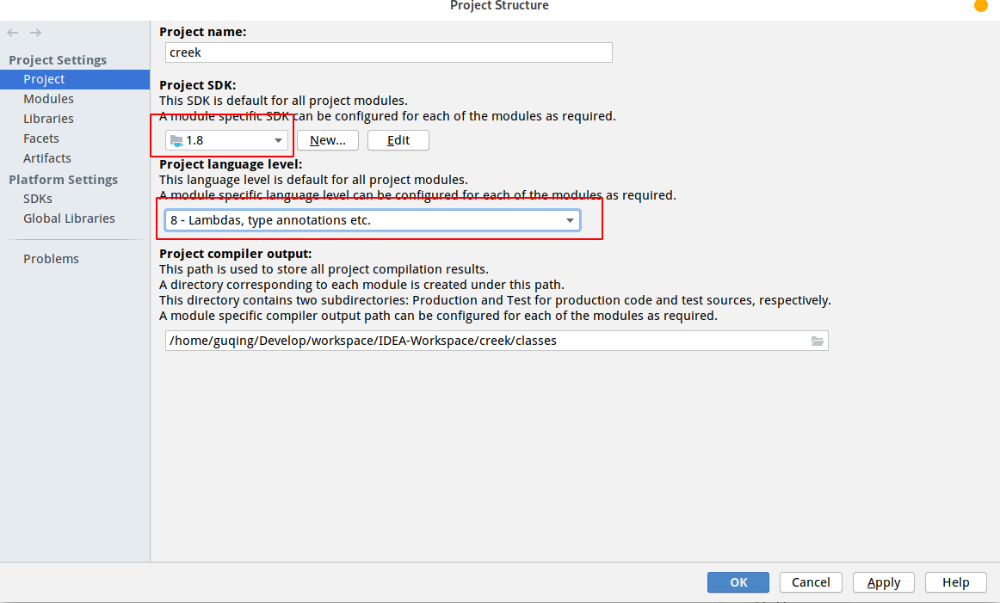
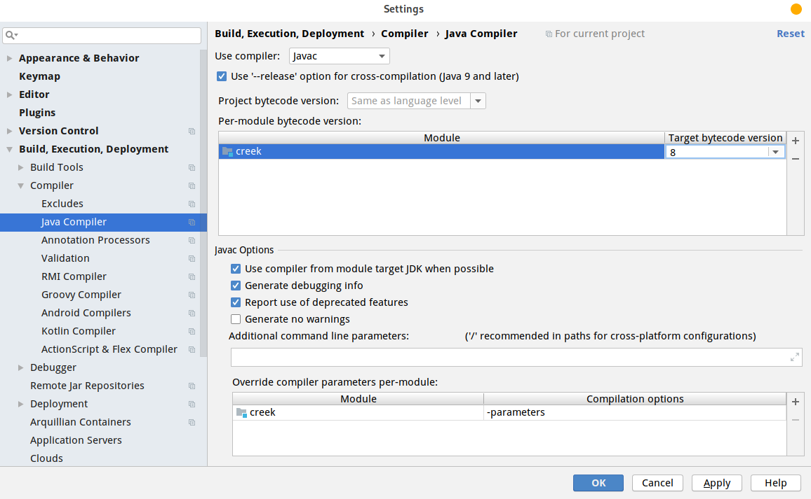
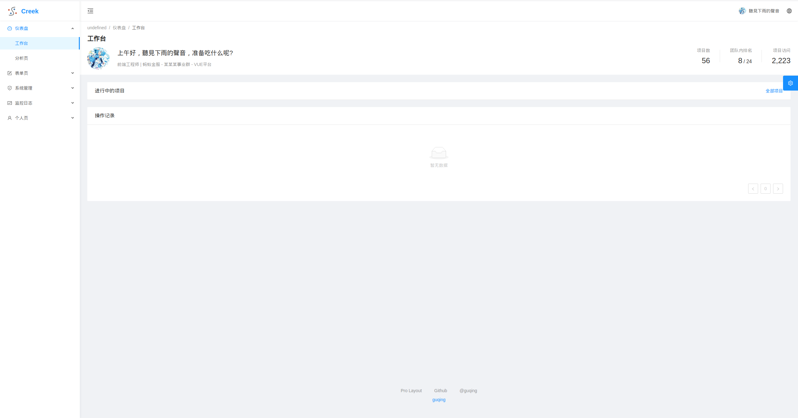
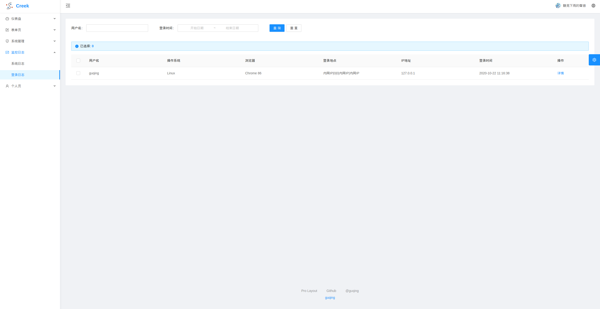
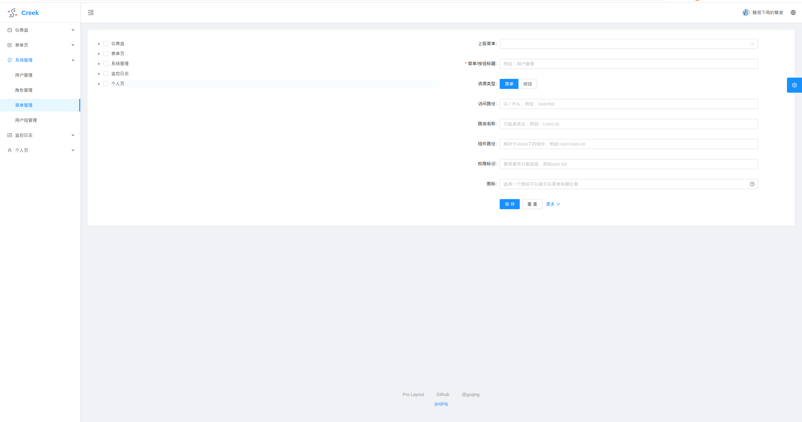
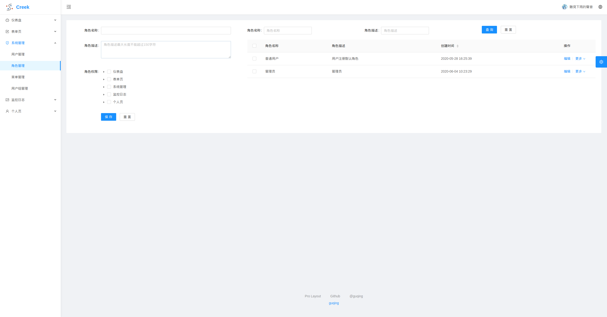
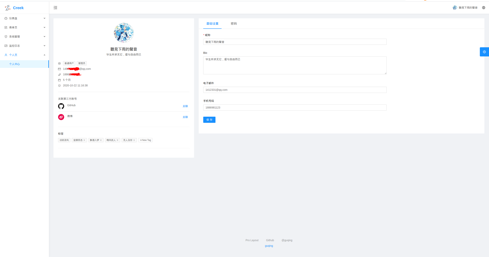

# Creek
## 简介
这是一个基于`SpringBoot 2.2.2.RELEASE`，用于搭建`RESTful API`快速开发脚手架, 使用`Spring Security` + `JWT Token` + `RBAC`的方式实现认证和授权，持久层使用`Mybatis plus`。避免每次重复编写认证和授权功能、角色管理、异常处理、参数校验等代码，直接上手业务代码，不再烦恼于构建项目与风格统一。

## 所需环境
- IDE：IntelliJ IDEA 或者 STS（Spring Tools Suite）
- 工具：Maven，Lombok 插件
- JDK：1.8+
### 安装Lombok插件
1. 本项目使用了 Lombok，运行 `Creek` 之前请检查 IDE 是否已经安装好了 Lombok 插件。
2. 对于IntelliJ IDEA，请在设置中启用 `Build -> Execution -> Deployment/Annotation Processors` 的 `Enable annotation processing`。
### 可选设置
本项目默认使用`jdk11`,如果没有`jdk11`可以切换到`jdk1.8`,首先修改`pom.xml`中`java.version`为`1.8`
```xml
<properties>
   <java.version>1.8</java.version>
</properties>
```
然后点击如下图所示位置的项目结构设置


如下修改jdk版本为`1.8`


点击`File->Settings`设置`Java complier`如下图所示

## 运行项目
1.本项目默认使用`H2`数据库，首次启动修改如下配置会自动创建数据库文件并初始化
```properties
spring:
  datasource:
    initialization-mode: always
```
启动后在将改配置值改为`never`，防止每次都初始化

2.运行`AppApplication`

## 特性
- 认证和授权
- security权限管理
- 全局异常处理
- 全局参数校验
- 统一项目风格
- 支持第三方社交登录
- 基于角色的权限控制
- 动态路由
- 基于自定义指令细划到按钮级别权限控制
- aop+自定义注解处理日志

[前端使用示例项目](https://github.com/guqing/creek-ui)

## 项目预览






## 项目结构
```
src
|─main
|  |─java
|  |  |─xyz.guqing.creek                  ------ 根包名
|  |  |  |─aspect                          ------ aop切面
|  |  |  |─config                         ------ springboot自动配置
|  |  |  |─controller                     ------ controller接口
|  |  |  |─mapper                      	  ------ mybatis mapper接口
|  |  |  |─exception                      ------ 自定义异常
|  |  |  |─service                        ------ service层
|  |  |  |─model                          ------ 模型类
|  |  |  |  |─entity                      ------ 数据库对应的实体
|  |  |  |  |─enums                       ------ 枚举
|  |  |  |  |─params                      ------ controller中入参数修改类型的入参数命名为xxxParam查询的为xxxQuery
|  |  |  |  |─dto                         ------ controller出参实体
|  |  |  |  |─annotation                  ------ 自定义注解
|  |  |  |  |─dos                         ------ 数据库组合实体例如关联查询需要多表字段组合
|  |  |  |  |─bo                          ------ 业务逻辑实体，例如支付service方法调用支付方法传递组合参数
|  |  |  |  |─properties                  ------ 自动配置properties实体
|  |  |  |─factory                        ------ 自定义工厂类
|  |  |  |─event                          ------ 自定义事件
|  |  |  |─listener                       ------ 事件监听器
|  |  |  |─convert                        ------ 自定义类型转换器
|  |  |  |─handler                        ------ 处理器类
|  |  |  |─security                       ------ spring security安全控制
|  |  |  |─utils                          ------ 自定义工具类
|  |─resources
|  |  |─db                                ------ 数据库sql
|  |  |─mapper                            ------ mybatis自定义mapper xml
|  |  |─templates                         ------ 模板文件例如邮件模板
|─test
|  |─java
|  |  |─com.happyland.ums
|  |  |  |─service                        ------ service层单元测试类
|  |  |  |─utils                          ------ 自定义工具单元测试类
```
## 编码风格
### controller风格
#### controller入参示例
```java
@PostMapping("/save")
public ResultEntity<String> createOrUpdate(@RequestBody @Valid MenuParam menuParam) {
    Menu menu = menuParam.convertTo();
    menuService.saveOrUpdate(menu);
    return ResultEntity.ok();
}
```
因为是创建方法属于修改数据因此参数为xxxParam，这样的好处还便于使用注解做参数校验
```java
@Data
@JsonIgnoreProperties(ignoreUnknown = true)
public class MenuParam implements InputConverter<Menu> {
    private Long id;

    private Long parentId;

    @NotBlank(message = "菜单标题不能为空")
    @Size(max = 150, message = "菜单标题不能字符长度不能大于 {max}")
    private String title;

    private String type;

    private String path;
    
	// ...

    @Override
    public Menu convertTo() {
        if(parentId == null) {
            parentId = 0L;
        }
        if(sortIndex == null) {
            sortIndex = 0L;
        }

        if(keepAlive == null) {
            keepAlive = false;
        }

        type = MenuType.valueFrom(type);

        return InputConverter.super.convertTo();
    }
}
```
所有Param方法需要实现InputConverter接口泛型对应数据库实体，所有Param的参数转换都再controller中做，xxxQuery可以除外，如果需要赋默认值或者类型或者名称转换等则覆盖convertTo方法，该方法灵活运用,例如赋值默认值后使用父类转换逻辑则返回InputConverter.super.convertTo()即可,也可以如下
```java
@Override
public Menu convertTo() {
    Menu menu = new Menu();
    BeanUtils.copyProperties(this, menu);
    menu.setTitle(this.name);
    menu.setPath(this.name + "/" + this.title);
    return menu;
}
```
可以满足绝大部分的类型转换问题，从而减少对业务逻辑的干扰,提高可读性和代码简洁度，Param转数据库实体时使用如下方式
```java
Menu menu = menuParam.convertTo();
```
#### controller出参示例
```java
@GetMapping("/options")
public ResultEntity<List<RoleDTO>> listAll() {
    List<Role> list = roleService.list();
    return ResultEntity.ok(convertTo(list));
}
private List<RoleDTO> convertTo(List<Role> list) {
    if(CollectionUtils.isEmpty(list)) {
        return Collections.emptyList();
    }
    return list.stream()
        .map(role -> (RoleDTO)new RoleDTO().convertFrom(role))
        .collect(Collectors.toList());
}
```
对于分页,可以使用如下方式
```java
@GetMapping("list")
public ResultEntity<PageInfo<RoleDTO>> listBy(RoleQuery roleQuery, PageQuery pageQuery) {
    roleQuery.setPageQuery(pageQuery);
    Page<Role> pageInfo = roleService.listBy(roleQuery);
    return ResultEntity.okList(pageInfo, role -> new RoleDTO().convertFrom(role));
}
```
controller出参一律返回DTO对于模板引擎需要的参数返回xxxVO,不得直接返回数据库实体,参数转换同样再controller中做，除非是需要特殊数据controller无法转换则再service中返回DTO
```java
@Data
public class RoleDTO implements OutputConverter<RoleDTO, Role> {
    private Long id;
    private String roleName;
    private String remark;
    private LocalDateTime createTime;
    private Set<Long> menuIds;
}
```
如上DTO实现OutputConverter便于出参类型转换，实现该接口以后数据库实体转DTO则如下操作即可
```java
RoleDTO roleDto = new RoleDTO().convertFrom(role)
```
